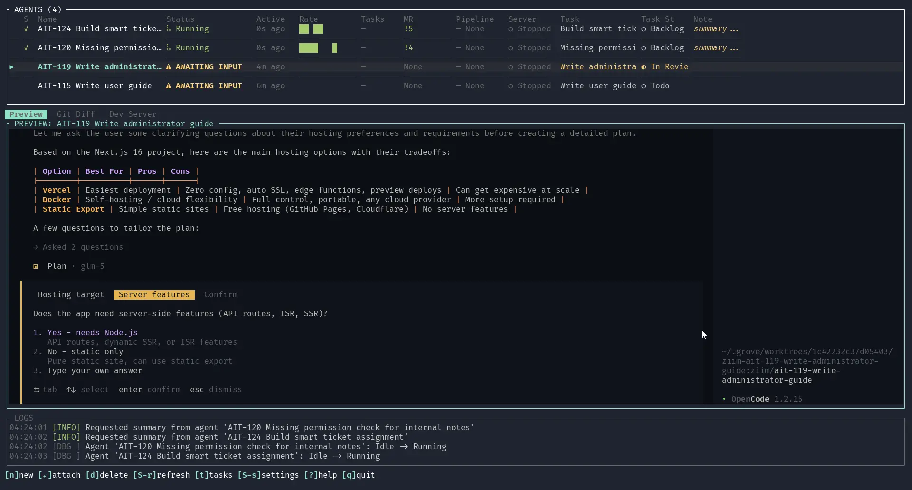
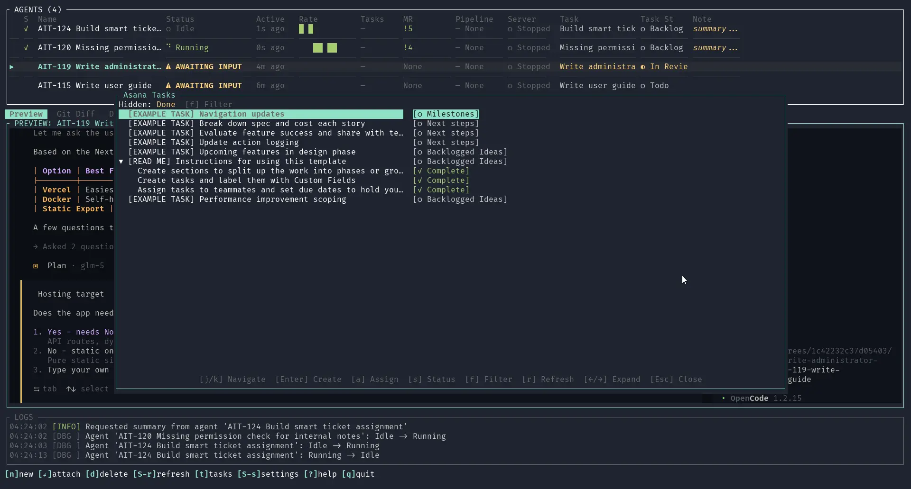
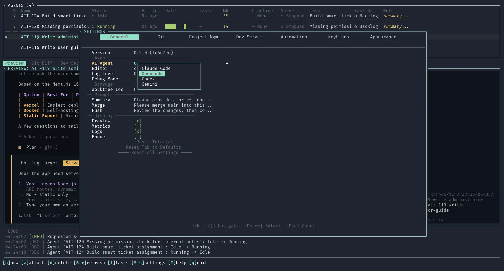

# Grove

[](https://opensource.org/licenses/MIT)
[](https://github.com/ZiiMs/homebrew-grove)

A terminal UI for managing multiple AI coding agents with git worktree isolation.

**Website: https://grove.ziim.dev/**

Grove allows you to run multiple AI coding agents simultaneously, each working on its own git branch in an isolated worktree. Monitor their progress, attach to their terminal sessions, and integrate with your existing tools.

## Screenshots

**Agent List with Preview Panel**



**Task List View**



**Settings Panel**



## Features

- **Multi-Agent Management**: Run multiple AI agents in parallel, each in its own tmux session
- **Multiple AI Providers**: Supports Claude Code, Opencode, Codex, and Gemini CLI
- **Git Worktree Isolation**: Each agent works on a separate branch in an isolated worktree
- **Real-Time Monitoring**: See live output, detect status (running, waiting, error), track token usage
- **Git Provider Integration**: GitLab, GitHub, and Codeberg support with MR/PR and pipeline status
- **Project Management Integration**: Asana, Notion, ClickUp, Airtable, and Linear task tracking
- **Dev Server Management**: Start, restart, and monitor development servers per agent
- **Session Persistence**: Agent sessions persist across restarts with tmux
- **Customizable Keybinds**: All keyboard shortcuts can be personalized
- **System Metrics**: Monitor CPU and memory usage while agents work

## Comparison

| Feature | Grove | Manual tmux + worktree | git-worktree-manager |
|---------|-------|------------------------|---------------------|
| Multi-agent TUI | Yes | No | No |
| AI agent detection | Yes | No | No |
| Task management integration | Yes | No | No |
| Git provider integration | Yes | No | No |
| Dev server management | Yes | No | No |
| Session persistence | Yes | Manual | No |
| Customizable keybinds | Yes | No | No |

## Prerequisites

### Required

1. **tmux**
   ```bash
   # macOS
   brew install tmux

   # Ubuntu/Debian
   sudo apt install tmux

   # Fedora
   sudo dnf install tmux
   ```

2. **Git** (version 2.5+ with worktree support)

3. **An AI coding CLI** - at least one of:
   - [Claude Code](https://claude.ai/code) (`claude`)
   - [Opencode](https://opencode.ai) (`opencode`)
   - [Codex](https://github.com/openai/codex) (`codex`)
   - [Gemini CLI](https://github.com/google-gemini/gemini-cli) (`gemini`)

### Optional (for integrations)

- GitLab, GitHub, or Codeberg account with API token
- Asana, Notion, ClickUp, Airtable, or Linear account with API token

## Installation

### Homebrew (macOS, recommended)

```bash
brew install ZiiMs/grove/grove
```

### Quick Install (Linux/macOS)

```bash
curl -fsSL https://raw.githubusercontent.com/ZiiMs/Grove/main/install.sh | bash
```

The installer will:
- Detect your platform and architecture
- Download the latest release binary
- Install to `~/.local/bin` (or specify with `--bin-dir`)
- Optionally install tmux if missing

#### Install Options

```bash
# Install to custom directory
curl -fsSL https://raw.githubusercontent.com/ZiiMs/Grove/main/install.sh | bash -s -- --bin-dir /usr/local/bin

# Install specific version
curl -fsSL https://raw.githubusercontent.com/ZiiMs/Grove/main/install.sh | bash -s -- --version 0.2.0

# Skip dependency installation
curl -fsSL https://raw.githubusercontent.com/ZiiMs/Grove/main/install.sh | bash -s -- --no-deps
```

### From crates.io

```bash
cargo install grove-ai
```

### From Source

```bash
git clone https://github.com/ZiiMs/Grove.git
cd Grove
cargo build --release
cp target/release/grove ~/.local/bin/
```

## Quick Start

```bash
# Navigate to any git repository
cd /path/to/your/project

# Run grove
grove

# Or specify a repository path
grove /path/to/your/project
```

## Configuration

Grove uses a two-level configuration system:

### Global Config (`~/.grove/config.toml`)

User preferences stored globally:

```toml
[global]
ai_agent = "claude-code"  # claude-code, opencode, codex, gemini
log_level = "info"
worktree_location = "project"  # project or home

[ui]
frame_rate = 30
tick_rate_ms = 250
output_buffer_lines = 5000

[performance]
agent_poll_ms = 500
git_refresh_secs = 30
```

### Project Config (`.grove/project.toml`)

Project-specific settings stored in your repo (can be committed):

```toml
[git]
provider = "gitlab"           # gitlab, github, codeberg
branch_prefix = "feature/"
main_branch = "main"

[dev_server]
command = "npm run dev"
port = 3000
auto_start = false
```

**Note:** Git provider settings (owner, repo, project IDs) are auto-detected from your git remotes. You only need to configure them manually if auto-detection fails.

## API Tokens

Grove reads API tokens from environment variables. Set these in your shell profile:

### Git Providers

```bash
# GitLab
export GITLAB_TOKEN="glpat-your-token"

# GitHub  
export GITHUB_TOKEN="ghp_your-token"

# Codeberg
export CODEBERG_TOKEN="your-token"
```

### Project Management

```bash
export ASANA_TOKEN="your-asana-token"
export NOTION_TOKEN="your-notion-token"
export CLICKUP_TOKEN="your-clickup-token"
export AIRTABLE_TOKEN="your-airtable-token"
export LINEAR_TOKEN="your-linear-token"
```

### Creating Tokens

**GitLab:** User Settings → Access Tokens → Create token with `api` scope

**GitHub:** Settings → Developer settings → Personal access tokens → `repo` scope

**Asana:** [Developer Console](https://app.asana.com/0/developer-console) → Create new token

**Notion:** [My integrations](https://www.notion.so/my-integrations) → New integration

**ClickUp:** Settings → Apps → API Token

**Airtable:** [Personal access tokens](https://airtable.com/create/tokens)

**Linear:** Settings → API → Personal API keys

## Usage

### Keyboard Shortcuts

All keybinds are customizable in `~/.grove/config.toml`. Defaults:

#### Navigation
| Key | Action |
|-----|--------|
| `j` / `↓` | Move to next agent |
| `k` / `↑` | Move to previous agent |
| `g` | Go to first agent |
| `G` | Go to last agent |

#### Agent Management
| Key | Action |
|-----|--------|
| `n` | Create new agent |
| `d` | Delete selected agent |
| `Enter` | Attach to agent's tmux session |
| `N` | Set/edit custom note |
| `s` | Request work summary |
| `y` | Copy agent/branch name |

#### Git Operations
| Key | Action |
|-----|--------|
| `c` | Copy `cd` command to worktree |
| `m` | Send merge main request |
| `p` | Push changes |
| `f` | Fetch remote |

#### Integrations
| Key | Action |
|-----|--------|
| `o` | Open MR/PR in browser |
| `a` | Assign task to agent |
| `A` | Open task in browser |
| `t` | Toggle task list |
| `e` | Open worktree in editor |

#### Other
| Key | Action |
|-----|--------|
| `R` | Refresh all status |
| `?` | Toggle help overlay |
| `L` | Toggle logs view |
| `S` | Toggle settings |
| `/` | Toggle diff view |
| `q` | Quit |

### Creating an Agent

1. Press `n` to create a new agent
2. Enter a branch name
3. Grove will:
   - Create a new git branch
   - Create a git worktree for isolated work
   - Start a tmux session
   - Launch your configured AI agent

### Attaching to an Agent

Press `Enter` to attach to an agent's tmux session. Detach with `Ctrl+B` then `D`.

## Troubleshooting

### "tmux is not installed or not in PATH"

Install tmux using your package manager (see Prerequisites).

### "Not a git repository"

Run Grove from within a git repository, or specify a path as an argument.

### Integration not working

1. Verify the token is set: `echo $GITLAB_TOKEN`
2. Check logs with `L` key
3. Test the token directly with curl

### Agent stuck in wrong status

Press `R` to force refresh all agent statuses.

### Session persistence issues

Sessions are stored in `~/.grove/sessions/`. Delete the relevant file to start fresh.

## Architecture

```
grove/
├── src/
│   ├── main.rs          # Entry point, event loop
│   ├── lib.rs           # Module exports
│   ├── agent/           # Agent model, status detection
│   ├── app/             # State, config, actions
│   ├── asana/           # Asana API client
│   ├── notion/          # Notion API client
│   ├── clickup/         # ClickUp API client
│   ├── airtable/        # Airtable API client
│   ├── linear/          # Linear API client
│   ├── git/             # Git operations, worktree
│   ├── gitlab/          # GitLab API client
│   ├── github/          # GitHub API client
│   ├── codeberg/        # Codeberg API client
│   ├── storage/         # Session persistence
│   ├── tmux/            # tmux session management
│   └── ui/              # TUI components
└── Cargo.toml
```

## Credits

Grove is built with:

- [ratatui](https://github.com/ratatui-org/ratatui) - TUI framework
- [git2](https://github.com/rust-lang/git2-rs) - Git operations
- [tokio](https://github.com/tokio-rs/tokio) - Async runtime
- [tmux](https://github.com/tmux/tmux) - Terminal multiplexing

Thanks to Anthropic, OpenAI, and Google for their AI coding assistants.

## License

MIT
